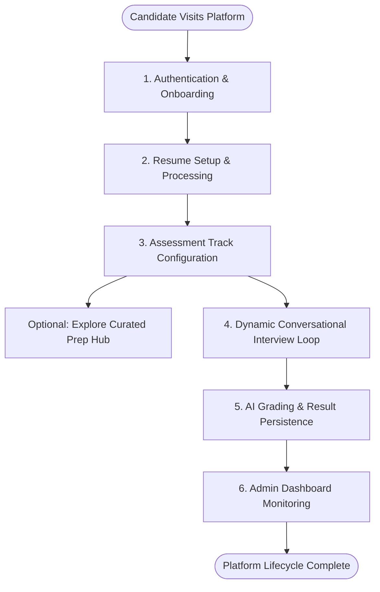
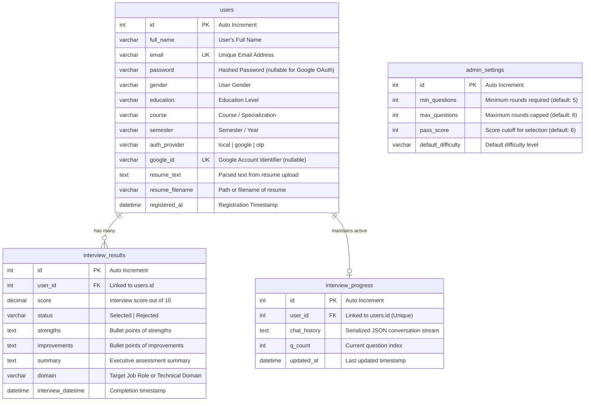

# 🤖 AI Interview Platform

An enterprise-grade, full-stack conversational mock interview platform engineered to prepare candidates for modern technical and non-technical roles through highly realistic, adaptive, and personalized simulations. The system leverages state-of-the-art Large Language Models (specifically Google Gemini AI) acting as a dynamic examiner, while a robust relational database layer (featuring SQLAlchemy with native support for MySQL, PostgreSQL, and SQLite fallback) securely persists candidate personas, resume data, and chronological scorecards. Engineered with production-ready resiliency, the application integrates multi-provider OTP verification loops, real-time voice-to-text dictation, and complete administrative control dashboards to bridge the gap between academic preparation and professional recruitment standards.

---

## 🚀 Core Innovations

* **Stateful Conversational Interview Engine**: Unlike conventional platforms that serve static question banks, this system models each interview as a live, stateful dialogue. On every interaction, the complete conversation transcript is forwarded to the AI examiner, enabling it to construct contextually intelligent follow-up questions that directly respond to the candidate's preceding answer — mirroring the reasoning pattern of a real human interviewer.

* **Adaptive Difficulty Scaling**: The assessment engine continuously evaluates response quality and recalibrates the complexity of subsequent questions accordingly. Strong, well-articulated answers trigger a progressive escalation in technical depth, while incomplete or uncertain responses prompt the AI to revisit foundational concepts — creating a self-correcting evaluation loop that reflects actual interview dynamics.

* **Resume-Driven Personalisation**: Candidates may upload their CV in PDF format. The platform parses and indexes the extracted text into the candidate's database profile, which is then embedded into the AI's prompt context at assessment time. This allows the examiner to ask role-specific, project-aware, and technology-relevant questions drawn directly from the candidate's professional background.

* **Persistent Session Architecture**: Rather than relying on browser-native cookie storage — which imposes a strict 4KB payload ceiling — active interview transcripts are serialised and persisted in a dedicated relational database table. This guarantees full session continuity across network interruptions, tab closures, or browser refreshes, without any loss of conversational state.

* **Zero-Downtime Schema Auto-Migration**: On every application boot, the platform introspects the live database schema and programmatically applies any missing column definitions. This eliminates manual migration steps, prevents schema drift across environments, and ensures backward compatibility when new candidate data fields are introduced.


---

## 🔄 End-to-End Application Workflow

The platform operates as a cohesive lifecycle that takes a candidate from registration to a final AI-generated scorecard.



### 1. Authentication & Onboarding
* Candidates can sign up locally or instantly log in via third-party OAuth providers (Google OAuth 2.0). 
* To ensure secure registrations, the backend runs a multi-provider OTP verification loop. Once a candidate submits their email, the system automatically dispatches a unique one-time password (OTP) via high-priority mail delivery channels before password configuration.

### 2. Resume Setup & Processing
* After verifying their account, candidates can upload their resume in PDF format.
* The backend extracts the raw text from the resume on submission. It saves this information to the database profile, creating a persistent technical persona that the AI can references during assessments.

### 3. Assessment Track Configuration
* Candidates set up their practice sessions by choosing their target technical domain (e.g. Data Science, React Frontend, Backend python), their target difficulty level, and their general experience class (e.g., student or professional).
* Alternatively, candidates can browse the built-in Prep Hub, which contains curated lists of external technical challenges and interview guides for top-tier companies.

### 4. Dynamic Conversational Interview Loop
* Once the practice session starts, the application initialises a session-tracking entity in the database.
* The system constructs a prompt payload utilizing candidate experience details, target difficulty, parsed resume summaries, and the running chat transcript.
* The AI generates a tailored, domain-specific question.
* The candidate responds either by typing or by using voice-to-text recording, which transcribes microphone audio directly into the answer fields in real-time.
* This conversational exchange loops dynamically. Behind the scenes, the AI checks if it has gathered enough criteria to grade the candidate, terminating the interview once the target rounds (between 5 and 8) are complete.

### 5. AI Grading & Result Persistence
* After the final question is answered, the full conversational transcript is forwarded to the evaluation model.
* The AI parses the candidate's communication depth, analytical capability, and domain accuracy, generating a scorecard containing an overall score (out of 10), bulleted strengths, improvements, and an executive summary.
* The system checks the configured passing threshold from the database, tags the result status as Selected or Rejected, and saves the scorecard, clearing active progress records.
* Candidates are redirected to an interactive scorecard dashboard featuring deep review options and PDF download capabilities.

### 6. Admin Dashboard Monitoring
* Administrators access a protected dashboard containing aggregate metrics (all-time interviews, daily counts).
* Admins can inspect individual candidate profiles, read full Q&A transcripts, prune obsolete records, and customize assessment limits or pass scores globally.


## 🚀 Key Features

* **Dual-Method Authentication Gateway**: Seamless local registration with Werkzeug password hashing alongside Google OAuth 2.0 OpenID Connect flows.
* **Multi-Provider OTP Routing**: An email routing dispatcher that automatically tries Resend HTTP API, SendGrid HTTP API, and SMTP fallbacks sequentially, avoiding Render port blocks.
* **Web Speech Voice Integration**: Hands-free voice dictation enabling users to speak their answers using client-side microphone APIs.
* **Visual Evaluation Reports**: Detailed AI-graded summaries mapping scores, strengths, weaknesses, and direct download links to printable PDF scorecards.
* **Operational Control Center**: Admin panel featuring real-time candidates lists, click-through transcript readers, and settings consoles to configure global question caps and pass score thresholds.
* **Theme-Optimized Design System**: High-performance Bootstrap 5 user interface featuring dark-mode gradients, smooth state transitions, and responsive cards.

---

## 📊 Detailed Database Schema & ER Model



### Database Tables Breakdown
1. **`users` Table**: Stores candidate profile information, registration method (local, OAuth, or OTP), and parsed resume texts used to tailor the interview.
2. **`interview_results` Table**: Persists the outcomes of completed mock interviews, containing the overall evaluation details (score, verdict status, strengths, improvements, domain, and completion times).
3. **`interview_progress` Table**: Backs up in-progress assessment states (including the serialized chat history) so candidates can resume if disconnected, bypassing browser session storage limits.
4. **`admin_settings` Table**: Holds global evaluation parameters editable by administrative accounts.

---

## 🧠 Gemini AI Prompt Mechanics & Logic Flow

The AI engine uses Google Gemini dynamically in two operational loops:

```
[Candidate starts practice]
       │
       ▼
1. Adaptive Question Loop
   ├── Input context: target domain + difficulty + parsed resume text + full chat history
   ├── Prompt constraint: Output strictly ONLY a single raw question (under 2 sentences). No fluff.
   └── Output: Next question served to candidate
       │
[Loop repeats 5 to 8 times until Gemini signals completion or max count is reached]
       │
       ▼
2. Full Transcript Evaluation
   ├── Input context: Full interview Q&A transcript
   ├── Prompt constraint: Output JSON with: score, strengths, improvements, summary
   └── Output: Record saved in DB, linked to user, evaluation screen displayed to user
```

* **Dynamic Constraints**: The AI is strictly bound to the target domain, references candidate experience parameters, and is barred from outputting preambles or conversational filler.
* **Score-to-Verdict Mapping**: The system compares the AI evaluation score against the threshold set in `admin_settings` to dynamically determine candidate selection status.

---

## ⚙️ Configuration Parameters (Environment Variables)

The application consumes environment configurations from a local `.env` file. These configurations define authentication and mail APIs conceptually:

* **Core Settings**:
  * `SECRET_KEY`: Used by Flask to sign session cookies securely.
* **Database Connection**:
  * `DATABASE_URL`: Connection string mapping to external engines (MySQL/PostgreSQL). If undefined, falls back automatically to SQLite.
* **AI Platform API**:
  * `GEMINI_API_KEY`: API access key for connecting to Google Gemini AI models.
* **OAuth Credentials**:
  * `GOOGLE_CLIENT_ID` / `GOOGLE_CLIENT_SECRET`: Client IDs and secrets required for Google OAuth 2.0 logins.
* **OTP Delivery APIs**:
  * `RESEND_API_KEY` / `SENDGRID_API_KEY`: Integrations for Resend or SendGrid HTTP mail delivery.
  * `MAIL_USERNAME` / `MAIL_PASSWORD`: Standard SMTP credentials used as fallback delivery.
* **Operations Credentials**:
  * `ADMIN_EMAIL` / `ADMIN_PASSWORD`: Administrative dashboard credentials (auto-generated if not supplied).

---

## 🚀 Execution & Run Guide

1. **Clone the Repository**
   ```bash
   git clone https://github.com/MR360-TECH/AI_INTERVIEW_PLATFORM.git
   cd AI_INTERVIEW_PLATFORM
   ```

2. **Establish Python Virtual Environment**
   ```bash
   python -m venv venv
   # On Windows:
   venv\Scripts\activate
   # On MacOS/Linux:
   source venv/bin/activate
   ```

3. **Install Dependencies**
   ```bash
   pip install -r requirements.txt
   ```

4. **Verify / Run the Application**
   ```bash
   python app.py
   ```
   *Note: On startup, the SQL engine verifies tables and implements migrations dynamically.*

---

## 👨‍💻 Developed By

**Gowtham V**
