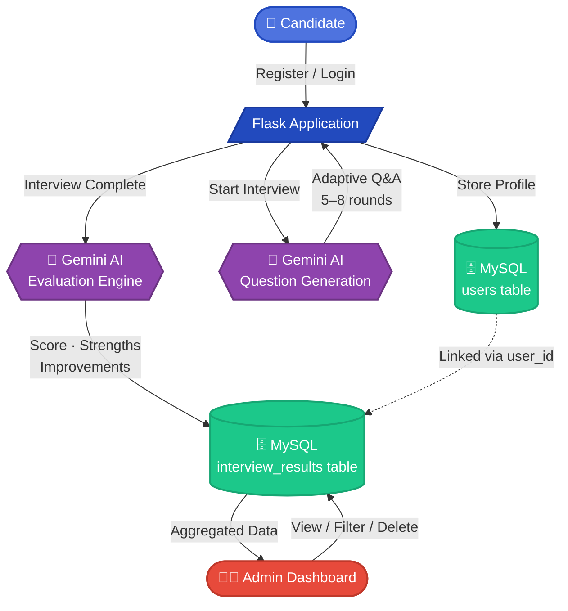
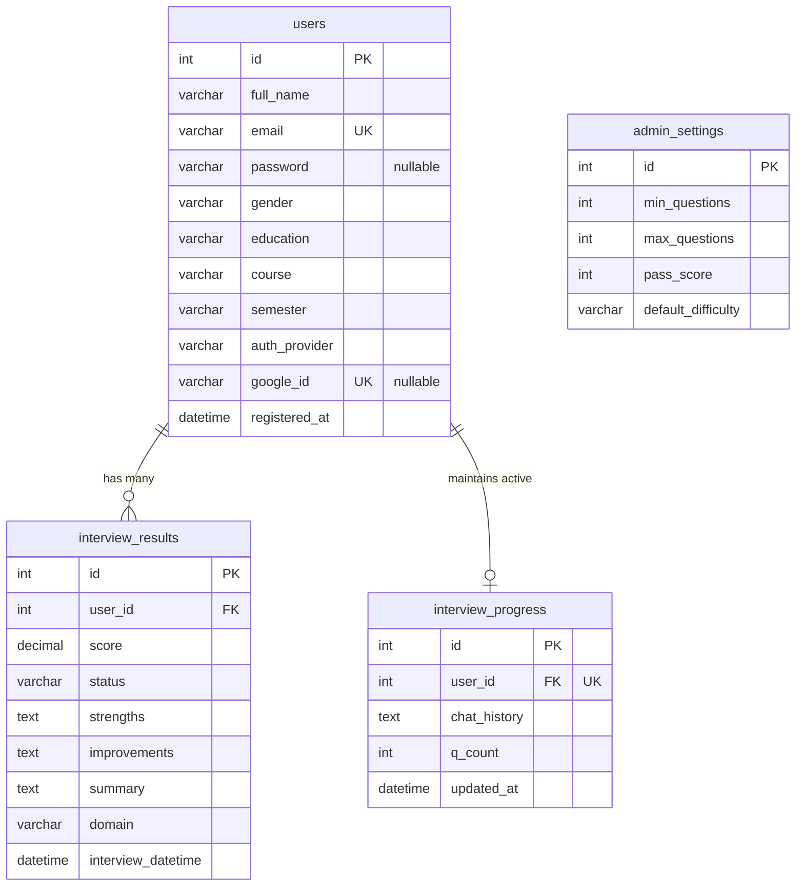

# 🤖 AI Interview Platform

A full-stack AI-powered mock interview web application built to help candidates practice realistic, adaptive job interviews using Google Gemini AI, with secure data management powered by MySQL.

**What makes this fundamentally different from typical mock interview tools:**

Most interview practice platforms — even ones marketed as "AI-powered" — are really just a fixed list of questions pulled from a database, shown in the same order to every single user. There's no real intelligence involved; it's a quiz, not an interview.

This platform works completely differently. There is no pre-written question bank at all. Every single question is generated live, in real time, by sending the AI the entire conversation history so far and asking it to decide what to ask next — the same way a real human interviewer listens to your last answer before deciding what to probe deeper into.

This means:
- Two candidates applying for the same role will get **completely different interviews**, because their answers differ
- The AI can choose to dig deeper into a weak answer, or move on quickly if a candidate is clearly strong in an area
- The interview isn't a fixed length — the AI itself decides, after a minimum of 5 questions, whether it has learned enough to fairly judge the candidate, or whether it needs to keep going (up to 8 questions)
- The final evaluation isn't a generic score either — it's generated by having the AI read back through the entire specific conversation it just had, and produce a score, strengths, and improvement areas unique to that exact interview

In short: this isn't a system that *simulates* an interview using pre-set content. It's a system where the AI genuinely conducts the interview, question by question, the same way a person would — which is what makes the practice experience meaningfully realistic rather than just another quiz with a chatbot wrapper.

---

## 🚀 Features

- 🔐 **Dual Authentication Methods**: Local user registration with hashed passwords (using Werkzeug) and single-click **Google OAuth integration** for verified logins.
- 🎙️ **Voice-to-Text Input**: Built-in speech recognition during assessments allowing candidates to dictate responses using their microphone.
- 🤖 **Adaptive Mock Interviews**: Realistic interview sessions where Gemini AI analyzes previous responses to generate subsequent questions dynamically (between 5 and 8 rounds).
- 📝 **Resume Assessment Progress**: Automated tracking of active sessions allowing candidates to resume their interview from where they left off.
- 📊 **AI-Generated Evaluations**: Detailed feedback containing an overall score, selection verdict, strengths, improvements, and a comprehensive summary.
- 📄 **Printable PDF Reports**: Premium candidate reports formatted for printing and download directly from the results interface.
- 👨‍💼 **Recruitment Operations Dashboard**: Clean admin interface showing analytics, real-time candidate search/filtering, candidate details, settings management, and records pruning.
- 📧 **Robust Multi-Provider OTP Delivery**: Seamless candidate verification powered by Resend HTTP, SendGrid HTTP, and local SMTP fallbacks to ensure compatibility with hosting providers (e.g., Render free tier) that block standard SMTP ports.
- 💾 **Database-Backed Progress Persistence**: Replaced cookie-based session state storage with dedicated database tables (`interview_progress`) to support long chat history transcripts without hitting the 4KB browser cookie limit.
- 🔄 **Dynamic Schema Migration**: Automatic database schema verification and auto-migration (such as dynamically injecting `resume_text` and `resume_filename` columns) on server boot.
- ⚙️ **Configurable Assessment Parameters**: Admin options to customize passing scores, question thresholds, and default academic level difficulty.
- 🎨 **Premium Modern Design System**: Responsive CSS with dynamic hover effects, smooth transitions, and modern cards layout.

---

## 🛠️ Tech Stack

### Frontend
- HTML5
- CSS3
- Bootstrap 5

### Backend
- Python
- Flask
- Jinja2 (templating)

### Database
- MySQL
- Flask-SQLAlchemy (ORM)

### AI
- Google Gemini API — used for both dynamic question generation and post-interview evaluation

### Security
- Werkzeug password hashing
- Flask session management
- Environment-based API key protection (`.env` + `.gitignore`)

### Version Control
- Git & GitHub

---

## 🏗️ System Architecture & Data Flow

Every candidate action flows through Flask, which coordinates between the MySQL database (for persistent storage) and the Gemini API (for live AI reasoning) — keeping the two cleanly separated so the AI never directly touches the database. The dotted line shows how `interview_results` stays linked back to `users` through the foreign key, allowing the Admin Dashboard to pull complete, joined candidate data in a single view.

---

## 🧠 How the Interview Works

1. **Registration & Login** — Candidate creates an account with their academic details; passwords are hashed before storage, never stored in plain text.
2. **Domain Discovery** — Once the interview starts, the AI's very first question always asks which role or domain the candidate is interviewing for.
3. **Adaptive Questioning** — Every subsequent question is generated fresh, using the entire conversation history as context, so the AI naturally probes deeper based on how the candidate has been answering.
4. **Smart Conclusion** — After a minimum of 5 questions, the AI is given the option to end the interview once it feels confident it has enough information to evaluate the candidate — up to a hard maximum of 8 questions.
5. **Evaluation** — The full transcript is sent to the AI one final time, which returns a structured score (out of 10), a list of strengths, and a list of improvement areas.
6. **Verdict & Storage** — The score is compared against a configured passing threshold to produce a Selected/Rejected verdict, and the entire result is saved to the database, linked to that candidate.

---

## 🗄️ Database Overview

**`users`**
Stores candidate registration details: ID, full name, email, hashed password, gender, education level, course, semester, registration method (`auth_provider` e.g., local or google), Google OAuth ID (`google_id`), and registration timestamp.

**`interview_results`**
Stores completed interview metrics and feedback: candidate ID reference, score, evaluation verdict (Selected/Rejected), AI-generated strengths, areas for improvement, executive summary, domain/job description, and execution timestamp.

**`interview_progress`**
Maintains the state of ongoing candidate assessment sessions: candidate ID reference, serialized chat history, current question count, and update timestamp. This allows candidates to seamlessly resume active assessments if disconnected.

**`admin_settings`**
Maintains global application configurations for assessments: minimum and maximum question thresholds, passing score cutoff, and default candidate difficulty settings.

---

## 📊 ER Diagram

Each user can have multiple interview results (one-to-many relationship) and a single active progress tracker (one-to-one relationship). All result and progress records are linked back to a user through foreign keys.

---

## 👨‍💼 Admin Dashboard

A protected dashboard, accessible only through dedicated admin credentials, provides full operational visibility:

- Total interviews conducted, all-time
- Today's interview count, filterable with a single click
- Complete candidate list with education, course, semester, score, and verdict
- Click-through access to any candidate's full profile and interview history
- Controls to delete individual interview records or entire candidate accounts

Regular candidate accounts are fully isolated from this dashboard — route-level checks ensure neither side can accidentally or deliberately access the other's pages.

---

## 🔐 Security Considerations

- Passwords are never stored in plain text — hashed using Werkzeug before saving
- The Gemini API key is kept out of source control entirely, loaded via environment variables from a `.env` file excluded through `.gitignore`
- Session-based access control prevents unauthorized access to protected routes, including strict separation between candidate and admin sessions
- Server-side email format validation backs up client-side checks, reducing the chance of malformed data reaching the database

---

## 🎯 Project Objective

To provide students and job seekers with an AI-powered interview preparation platform that improves technical knowledge, communication skills, confidence, and interview readiness through realistic, adaptive mock interviews — while giving administrators a centralized, data-driven view of candidate performance.

---

## 🔮 Future Enhancements

- 🎙️ Text-to-speech audio playback for AI examiner questions.
- ☁️ Public cloud deployment and automated scaling.
- 🌐 Multi-language support for international candidates.
- 📁 Physical resume parser to auto-fill profiles and customize interview tracks.

---

## 👨‍💻 Developed By

**Gowtham V**
