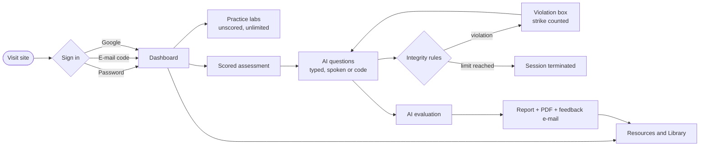
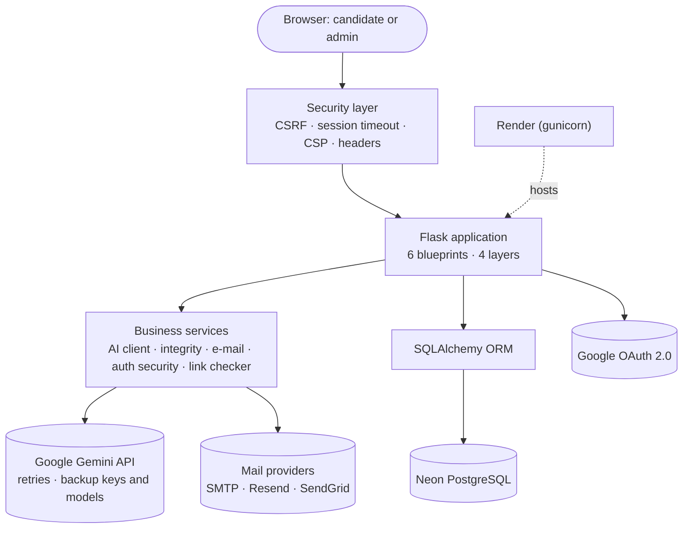
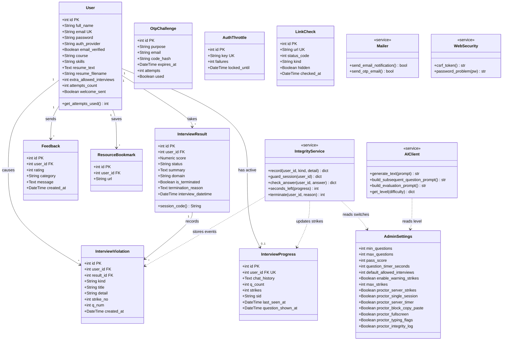
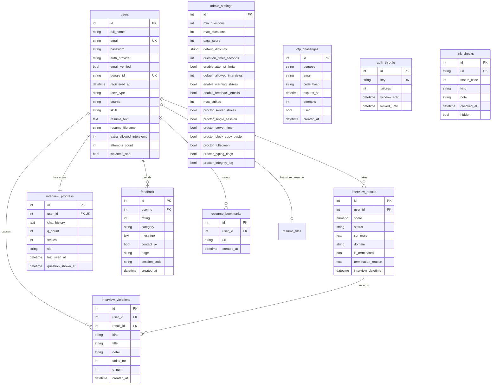
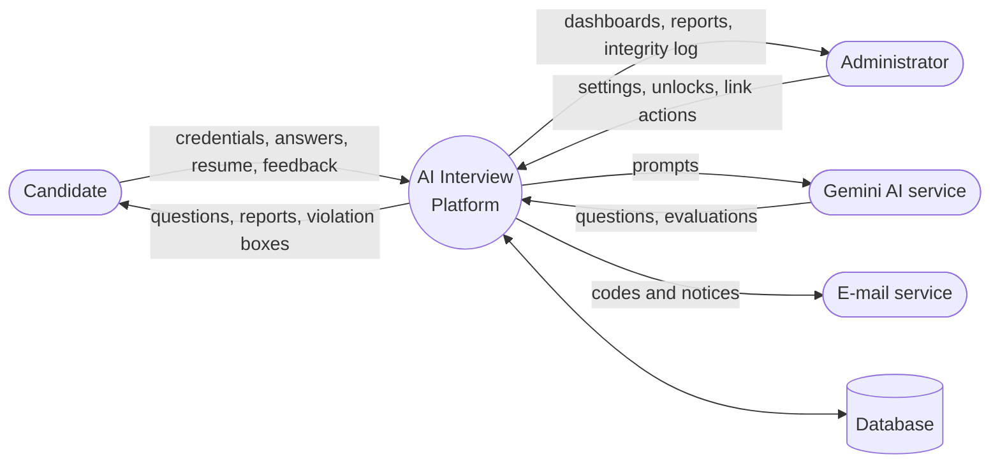
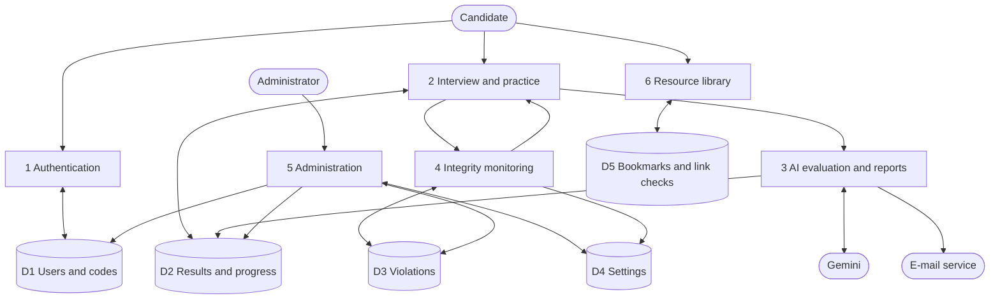
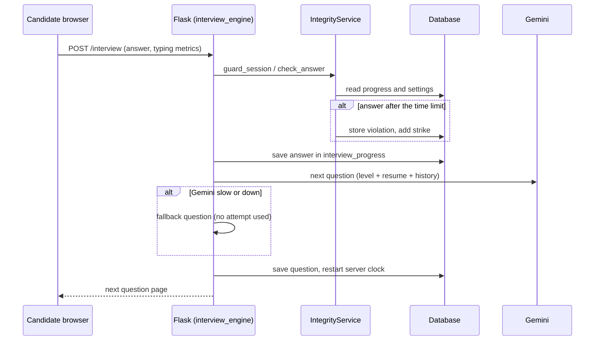
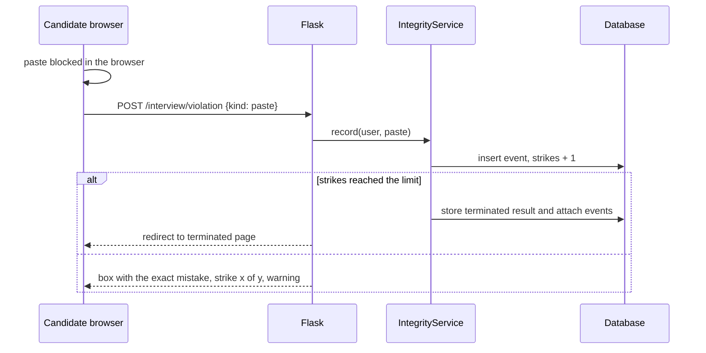

# 🤖 AI Interview Platform

[](https://python.org)
[](https://flask.palletsprojects.com/)
[](https://ai.google.dev/)
[](https://neon.tech/)
[](https://getbootstrap.com/)
[](https://render.com/)

> **An adaptive, AI-driven interview and assessment platform for organisations.** Companies, colleges and training providers get a fair, secure and auditable way to interview and evaluate candidates, with the administrator in full control of every rule. The same platform also works well for **mock interviews and practice**. Built with **Flask, SQLAlchemy and Google Gemini** on a clean 4-layer architecture.

---

## 📑 Table of Contents

1. [Abstract](#-abstract)
2. [Problem statement](#-problem-statement)
3. [Objectives and scope](#-objectives-and-scope)
4. [Existing vs proposed system](#-existing-vs-proposed-system)
5. [Key capabilities](#-key-capabilities)
6. [User journey](#-user-journey)
7. [System architecture](#-system-architecture)
8. [Modular 4-layer architecture](#-modular-4-layer-architecture)
9. [Class diagram](#-class-diagram)
10. [Entity-relationship (ER) diagram](#-entity-relationship-er-diagram)
11. [Data flow diagrams (DFD)](#-data-flow-diagrams-dfd)
12. [Sequence diagrams](#-sequence-diagrams)
13. [Interview integrity and anti-cheat](#-interview-integrity-and-anti-cheat)
14. [Security](#-security)
15. [AI engine and reliability](#-ai-engine-and-reliability)
16. [Preparation hub, library and practice labs](#-preparation-hub-library-and-practice-labs)
17. [Admin console](#-admin-console)
18. [E-mail system](#-e-mail-system)
19. [Requirement analysis](#-requirement-analysis)
20. [System stack](#-system-stack)
21. [Project structure](#-project-structure)
22. [Environment variables](#-environment-variables)
23. [Local setup](#-local-setup)
24. [Deployment](#-deployment-render-and-neon)
25. [Testing](#-testing)
26. [Roadmap](#-roadmap)
27. [FAQ](#-faq)
28. [Contact](#-contact)
29. [License](#-license)

---

## 📝 Abstract

The **AI Interview Platform** is a full-stack web application that simulates realistic hiring interviews and runs secure, scored assessments. A candidate signs in, optionally uploads a resume, chooses a domain, and is interviewed by an AI examiner built on **Google Gemini**. The examiner asks one question at a time, adapts to each answer and to the chosen difficulty level (Student, Mid-level or Senior), can refer to real items from the candidate's resume, and accepts typed answers, spoken answers (voice dictation) and code (an in-browser Monaco editor).

When the interview ends, the platform produces a **score out of 10** and a professional **four-paragraph evaluation**, a printable PDF scorecard with a unique session code, and a feedback e-mail with next steps. For learning, there are **five unscored practice labs** and a **searchable preparation library** with bookmarks and study plans.

For institutions, the **admin console** shows live results, manages candidates and attempts, and exposes every rule as a switch. A set of **server-side integrity rules** keeps scored assessments fair: every violation is a strike, the candidate always sees a box naming the exact mistake, and the administrator gets a private integrity log on every report. The system uses **Neon PostgreSQL**, is deployed on **Render**, and is verified by **949 automated checks** plus real-browser tests.

---

## ❗ Problem statement

Interview preparation and assessment have five long-standing gaps:

1. **No realistic practice.** Professional mock interviews are expensive, mentors are scarce, and static question lists never reproduce the pressure of live questioning.
2. **No personalisation.** Every student receives the same questions regardless of resume, domain, semester or experience level.
3. **Slow and inconsistent feedback.** Feedback arrives late, differs from mentor to mentor and is rarely specific enough to act on.
4. **Online assessments are easy to cheat in.** Tab switching, pasting answers, second devices and reloading to reset a timer are common, and institutions have little proof of what happened.
5. **Little visibility and control.** Administrators cannot easily see, audit or configure what a candidate experienced, and a failure of an external AI service can ruin a session.

---

## 🎯 Objectives and scope

| # | Objective | How it is met |
|---|---|---|
| 1 | Provide **adaptive, realistic** interviews | Gemini-based examiner with three difficulty levels, resume-aware questions, voice and code input |
| 2 | Deliver **fast, structured feedback** | Score out of 10, four-paragraph report, PDF scorecard, feedback e-mail |
| 3 | Keep assessments **fair and auditable** | Server-side strikes, one active session, server timer, copy/paste block, admin-only integrity log |
| 4 | Give administrators **full control** | Interview Settings with a switch per rule, strike limit, attempts, unlocks, link health, guided tour |
| 5 | Stay **reliable and secure** | Retries and fallbacks for the AI, saved interview state, CSRF, CSP, session timeouts, hashed codes |

**In scope:** a web application for candidates and an administrator; AI interviews, practice labs, a preparation library, e-mail notifications, reports and an admin console.
**Out of scope (see the roadmap):** webcam proctoring, multiple administrator roles, LMS/ATS integration, native mobile apps.

---

## ⚖️ Existing vs proposed system

| Aspect | Existing approach | This platform |
|---|---|---|
| Practice realism | Static question lists, paid mentors | Live, unscripted AI interview that follows each answer |
| Personalisation | None | Level-based prompts and questions drawn from the candidate's resume |
| Feedback | Late, informal, inconsistent | Instant score, four-paragraph report, PDF and e-mail |
| Cheating control | Browser-side, easy to bypass | Server-side strikes, one session, server clock, copy/paste block |
| Administrator control | Fixed rules | A switch for every rule, strike limit, attempts and unlocks |
| Failure handling | Session lost on error | State saved on the server; Back resumes; no attempt used |
| Visibility | Little or none | Admin dashboard, reports and an integrity log |
| Cost | Subscriptions | Runs on the free tiers of Render, Neon and Gemini |

---

## 🌟 Key capabilities

> [!TIP]
> **Who uses it:** organisations that screen or assess candidates (hiring drives, campus placements, training programmes, certification rounds), and candidates or institutions that want realistic **mock interviews** and practice.

**For candidates**
- 🧠 **Adaptive AI examiner** at three levels; about one question in three refers to something real in the resume.
- 🎙️ **Voice dictation** (Web Speech API), a **Monaco code editor**, file attachments, and a per-question timer kept on the server.
- 📊 **AI evaluation:** score out of 10, four-paragraph report, printable PDF, unique session code such as `AIS-000042`.
- ✉️ **Feedback e-mail** after every assessment, and a welcome e-mail once.
- 🎓 **Five practice labs** that never use an attempt: Academic Viva, Language practice, Concept Drill, Debate, Healthy Conversation.
- 📚 **Preparation hub** (113 pages) and **library** (92 links) with site logos, filters, bookmarks and three 7-day study plans.
- 🔑 **Three sign-in methods:** password, one-time e-mail code, and Google (with the account chooser).
- 💬 A **feedback box** with an animated confirmation.

**For administrators**
- 📈 **Live dashboard** with counters, filters, instant search and Recommended / Not recommended / Terminated results.
- 👥 **Candidate management:** summary cards, sorting, paging, attempts taken, one-click unlock, profile with resume viewer.
- 📋 **Report page:** score against the passing mark, evaluation notes, candidate sidebar and an **admin-only integrity log**.
- ⚙️ **Interview Settings:** question range, passing score, timer, level, attempts, a master switch with seven integrity switches, a strike limit, and the feedback-e-mail switch.
- 🔗 **Link Health** checker for the library, and an interactive **guided tour** (38 steps) with an 11-module manual.

**Platform qualities**
- 📱 Responsive on phones, with a dark cyan theme audited for contrast and smooth scrolling and page transitions.
- 🔁 A server error never uses an attempt: the interview is saved on the server and resumes at the next question.

---

## 🗺️ User journey


```mermaid
flowchart LR
    A([Visit site]) --> B{Sign in}
    B -->|Password| D[Dashboard]
    B -->|E-mail code| D
    B -->|Google| D
    D --> P[Practice labs<br/>unscored, unlimited]
    D --> R[Resources and Library]
    D --> S[Scored assessment]
    S --> Q[AI questions<br/>typed, spoken or code]
    Q --> I{Integrity rules}
    I -->|violation| W[Violation box<br/>strike counted]
    W --> Q
    I -->|limit reached| T[Session terminated]
    Q --> E[AI evaluation]
    E --> F[Report + PDF + feedback e-mail]
    F --> R
```

---

## 🔄 System architecture


```mermaid
flowchart TD
    Browser([Browser: candidate or admin]) --> Sec["Security layer<br/>CSRF · session timeout · CSP · headers"]
    Sec --> Flask["Flask application<br/>6 blueprints · 4 layers"]
    Flask --> Svc["Business services<br/>AI client · integrity · e-mail · auth security · link checker"]
    Svc --> Gemini[(Google Gemini API<br/>retries · backup keys and models)]
    Svc --> Mail[(Mail providers<br/>SMTP · Resend · SendGrid)]
    Flask --> ORM["SQLAlchemy ORM"]
    ORM --> DB[(Neon PostgreSQL)]
    Flask --> OAuth[(Google OAuth 2.0)]
    Render["Render (gunicorn)"] -.hosts.-> Flask
```

---

## 🏗️ Modular 4-layer architecture

All backend code lives in the `MODULES/` package. Each layer only depends on the layers below it.


```mermaid
flowchart TD
    subgraph L1["LAYER 1 · Core Infrastructure"]
        Config["config.py<br/>environment variables · database URL · Google OAuth<br/>secret key rules · upload limits · admin bootstrap"]
    end
    subgraph L2["LAYER 2 · Data Persistence"]
        Models["models.py<br/>User · InterviewResult · InterviewProgress · InterviewViolation<br/>AdminSettings · Feedback · OtpChallenge · AuthThrottle<br/>ResourceBookmark · LinkCheck · settings cache · attempt accounting"]
    end
    subgraph L3["LAYER 3 · Business Services"]
        AI["ai_client.py<br/>Gemini calls · retries · prompts per level"]
        INT["integrity.py<br/>strikes · one session · server timer · flags"]
        MAIL["mailer.py · email_templates.py · feedback_email.py"]
        SEC["auth_security.py · web_security.py"]
        LINK["link_checker.py"]
    end
    subgraph L4["LAYER 4 · Route Controllers (6 blueprints)"]
        LOGIN["login_env.py<br/>sign-up · login · OTP · Google · reset · profile"]
        DASH["dashboard.py<br/>dashboard · resume · history · feedback"]
        INTV["interview_engine.py<br/>interview · violation · heartbeat · result"]
        PRAC["practicemode.py<br/>practice labs · quit · reset"]
        ADM["admin_env.py<br/>dashboard · users · report · settings · guide · links"]
        RES["resources.py<br/>prep hub · library · bookmarks"]
    end
    App["MODULES/__init__.py · create_app()<br/>blueprints · security init · error pages · schema migration"]
    L1 --> L2 --> L3 --> L4 --> App
```

---

## 📐 Class diagram


```mermaid
classDiagram
    class User {
        +int id PK
        +String full_name
        +String email UK
        +String password
        +String auth_provider
        +Boolean email_verified
        +String course
        +String skills
        +Text resume_text
        +String resume_filename
        +int extra_allowed_interviews
        +int attempts_count
        +Boolean welcome_sent
        +get_attempts_used() int
    }
    class InterviewResult {
        +int id PK
        +int user_id FK
        +Numeric score
        +String status
        +Text summary
        +String domain
        +Boolean is_terminated
        +Text termination_reason
        +DateTime interview_datetime
        +session_code() String
    }
    class InterviewProgress {
        +int id PK
        +int user_id FK UK
        +Text chat_history
        +int q_count
        +int strikes
        +String sid
        +DateTime last_seen_at
        +DateTime question_shown_at
    }
    class InterviewViolation {
        +int id PK
        +int user_id FK
        +int result_id FK
        +String kind
        +String title
        +String detail
        +int strike_no
        +int q_num
        +DateTime created_at
    }
    class AdminSettings {
        +int min_questions
        +int max_questions
        +int pass_score
        +int question_timer_seconds
        +int default_allowed_interviews
        +Boolean enable_warning_strikes
        +int max_strikes
        +Boolean proctor_server_strikes
        +Boolean proctor_single_session
        +Boolean proctor_server_timer
        +Boolean proctor_block_copy_paste
        +Boolean proctor_fullscreen
        +Boolean proctor_typing_flags
        +Boolean proctor_integrity_log
    }
    class Feedback {
        +int id PK
        +int user_id FK
        +int rating
        +String category
        +Text message
        +DateTime created_at
    }
    class OtpChallenge {
        +int id PK
        +String purpose
        +String email
        +String code_hash
        +DateTime expires_at
        +int attempts
        +Boolean used
    }
    class AuthThrottle {
        +int id PK
        +String key UK
        +int failures
        +DateTime locked_until
    }
    class ResourceBookmark {
        +int id PK
        +int user_id FK
        +String url
    }
    class LinkCheck {
        +int id PK
        +String url UK
        +int status_code
        +String kind
        +Boolean hidden
        +DateTime checked_at
    }
    class IntegrityService {
        <<service>>
        +record(user_id, kind, detail) dict
        +guard_session(user_id) dict
        +check_answer(user_id, answer) dict
        +seconds_left(progress) int
        +terminate(user_id, reason) int
    }
    class AIClient {
        <<service>>
        +generate_text(prompt) str
        +build_subsequent_question_prompt() str
        +build_evaluation_prompt() str
        +get_level(difficulty) dict
    }
    class Mailer {
        <<service>>
        +send_email_notification() bool
        +send_otp_email() bool
    }
    class WebSecurity {
        <<service>>
        +csrf_token() str
        +password_problem(pw) str
    }
    User "1" --> "*" InterviewResult : takes
    User "1" --> "0..1" InterviewProgress : has active
    User "1" --> "*" InterviewViolation : causes
    InterviewResult "1" --> "*" InterviewViolation : records
    User "1" --> "*" Feedback : sends
    User "1" --> "*" ResourceBookmark : saves
    IntegrityService ..> InterviewProgress : updates strikes
    IntegrityService ..> InterviewViolation : stores events
    IntegrityService ..> AdminSettings : reads switches
    AIClient ..> AdminSettings : reads level
```

---

## 📊 Entity-relationship (ER) diagram


```mermaid
erDiagram
    users ||--o{ interview_results : takes
    users ||--o| interview_progress : "has active"
    users ||--o{ interview_violations : causes
    interview_results ||--o{ interview_violations : records
    users ||--o{ feedback : sends
    users ||--o{ resource_bookmarks : saves
    users ||--o| resume_files : "has stored resume"

    users {
        int id PK
        string full_name
        string email UK
        string password
        string auth_provider
        bool email_verified
        string google_id UK
        datetime registered_at
        string user_type
        string course
        string skills
        text resume_text
        string resume_filename
        int extra_allowed_interviews
        int attempts_count
        bool welcome_sent
    }
    interview_results {
        int id PK
        int user_id FK
        numeric score
        string status
        text summary
        string domain
        bool is_terminated
        text termination_reason
        datetime interview_datetime
    }
    interview_progress {
        int id PK
        int user_id FK, UK
        text chat_history
        int q_count
        int strikes
        string sid
        datetime last_seen_at
        datetime question_shown_at
    }
    interview_violations {
        int id PK
        int user_id FK
        int result_id FK
        string kind
        string title
        string detail
        int strike_no
        int q_num
        datetime created_at
    }
    admin_settings {
        int id PK
        int min_questions
        int max_questions
        int pass_score
        string default_difficulty
        int question_timer_seconds
        bool enable_attempt_limits
        int default_allowed_interviews
        bool enable_warning_strikes
        bool enable_feedback_emails
        int max_strikes
        bool proctor_server_strikes
        bool proctor_single_session
        bool proctor_server_timer
        bool proctor_block_copy_paste
        bool proctor_fullscreen
        bool proctor_typing_flags
        bool proctor_integrity_log
    }
    feedback {
        int id PK
        int user_id FK
        int rating
        string category
        text message
        bool contact_ok
        string page
        string session_code
        datetime created_at
    }
    otp_challenges {
        int id PK
        string purpose
        string email
        string code_hash
        datetime expires_at
        int attempts
        bool used
        datetime created_at
    }
    auth_throttle {
        int id PK
        string key UK
        int failures
        datetime window_start
        datetime locked_until
    }
    resource_bookmarks {
        int id PK
        int user_id FK
        string url
        datetime created_at
    }
    link_checks {
        int id PK
        string url UK
        int status_code
        string kind
        string note
        datetime checked_at
        bool hidden
    }
```

> [!TIP]
> The session code `AIS-000042` is derived from `interview_results.id`. `interview_violations.strike_no` is empty for review-only flags. Older databases are upgraded automatically at start-up: `ensure_columns()` adds new columns and `create_all()` adds new tables.

---

## 🔀 Data flow diagrams (DFD)

**Level 0: context diagram**


```mermaid
flowchart LR
    C([Candidate]) -- "credentials, answers, resume, feedback" --> P((AI Interview<br/>Platform))
    P -- "questions, reports, violation boxes" --> C
    A([Administrator]) -- "settings, unlocks, link actions" --> P
    P -- "dashboards, reports, integrity log" --> A
    P -- "prompts" --> G([Gemini AI service])
    G -- "questions, evaluations" --> P
    P -- "codes and notices" --> M([E-mail service])
    P <--> DB[(Database)]
```

**Level 1**


```mermaid
flowchart TD
    C([Candidate]) --> P1[1 Authentication]
    C --> P2[2 Interview and practice]
    C --> P6[6 Resource library]
    A([Administrator]) --> P5[5 Administration]
    P1 <--> D1[(D1 Users and codes)]
    P2 <--> D2[(D2 Results and progress)]
    P2 --> P4[4 Integrity monitoring]
    P4 <--> D3[(D3 Violations)]
    P4 --> P2
    P2 --> P3[3 AI evaluation and reports]
    P3 <--> G([Gemini])
    P3 --> D2
    P3 --> M([E-mail service])
    P5 <--> D4[(D4 Settings)]
    P5 --> D2
    P5 --> D3
    P5 --> D1
    P4 --> D4
    P6 <--> D5[(D5 Bookmarks and link checks)]
```

---

## ⏱️ Sequence diagrams

**One interview step (with integrity checks)**


```mermaid
sequenceDiagram
    participant U as Candidate browser
    participant S as Flask (interview_engine)
    participant I as IntegrityService
    participant D as Database
    participant G as Gemini
    U->>S: POST /interview (answer, typing metrics)
    S->>I: guard_session / check_answer
    I->>D: read progress and settings
    alt answer after the time limit
        I->>D: store violation, add strike
    end
    S->>D: save answer in interview_progress
    S->>G: next question (level + resume + history)
    alt Gemini slow or down
        S->>S: fallback question (no attempt used)
    end
    S->>D: save question, restart server clock
    S-->>U: next question page
```

**A violation (for example a paste attempt)**


```mermaid
sequenceDiagram
    participant U as Candidate browser
    participant S as Flask
    participant I as IntegrityService
    participant D as Database
    U->>U: paste blocked in the browser
    U->>S: POST /interview/violation {kind: paste}
    S->>I: record(user, paste)
    I->>D: insert event, strikes + 1
    alt strikes reached the limit
        I->>D: store terminated result and attach events
        S-->>U: redirect to terminated page
    else
        S-->>U: box with the exact mistake, strike x of y, warning
    end
```

---

## 🛡️ Interview integrity and anti-cheat

Scored assessments are protected by rules that are **counted and stored on the server**, so clearing browser data or editing the page cannot reset them. Practice labs are never proctored. Every rule has an admin switch under **Admin → Settings → Interview Settings**, there is a master "All integrity features" switch, and the **strike limit** is 1 to 5 (default 2).

| Rule | What it does | Strike |
|---|---|---|
| Proctoring and warning strikes (main switch) | Turns every rule on or off | - |
| Server-side strikes | Counts and stores every violation on the server | Yes |
| Leaving the exam window | Tab, window or app switch, with the time away | Yes |
| One active session | Another browser or device is refused and counted | Yes |
| Server-side timer | The clock lives on the server; late answers are counted | Late answers |
| Block copy and paste | Pasting into the answer box and copying the question are blocked | Yes |
| Require fullscreen (off by default) | Leaving fullscreen is a violation | Yes |
| Typing-pattern flags | Instant or inserted long answers are flagged for the admin | Review only |
| Integrity log | The admin sees every event with time, question and details | Display |

> [!IMPORTANT]
> [!NOTE]
> **Exit and interruptions.** Pressing **Exit** ends a scored assessment for good: the questions answered are analysed by the AI, the report and feedback e-mail are sent, and it counts as one attempt. Only a server error, a dropped connection or a closed tab leaves a saved interview, which the candidate continues from the dashboard (**Continue Assessment**); it can never be thrown away by restarting.

> Every violation shows the candidate a box that names the **exact mistake**, the strike count (for example *Strike 1 of 2*) and a warning. Reaching the limit ends the session; it is recorded as terminated and counts as one attempt.

---

## 🔐 Security

| Area | Protection |
|---|---|
| Forms and requests | CSRF token on every form and same-site request; destructive actions are POST-only |
| Sessions | Idle timeout (admin 30 min, candidate 2 h), 12-hour maximum, `HttpOnly` / `SameSite=Lax` / `Secure` cookies, no caching of signed-in pages |
| Headers | Content-Security-Policy, `X-Frame-Options`, `X-Content-Type-Options`, `Referrer-Policy`, HSTS in production |
| Sign-in | Keyed-hash one-time codes with expiry and attempt limits, brute-force lockouts, password strength rules, one generic login error, optional admin two-step sign-in |
| Secrets | No key in the source code; `SECRET_KEY` or a private key derived from `DATABASE_URL`; admin credentials only from environment variables |
| Data | Upload type and size checks; deleting a user also deletes files, events and bookmarks |
| Rate limits | Friendly, very generous request limits protect the AI quota from scripts and runaway loops; per account for signed-in users, never for administrators, never an attempt used; one admin switch (**Settings → Protection**) and `RATE_LIMIT_SCALE` / `RATE_LIMITS_ENABLED` |

---

## 🧠 AI engine and reliability

- **Models:** Google Gemini through `google-genai`, with retries, optional **backup API keys** (`GEMINI_BACKUP_KEYS`, which share the load, and a key that just ran out of quota is skipped for a while) and **backup models** (`GEMINI_FALLBACK_MODELS`).
- **Levels:** one definition per level (Student, Mid-level, Senior) feeds the question prompt, the system prompt and the evaluation prompt, so the way questions are asked and the way answers are scored always agree. Each level has its own scoring guide.
- **Evaluation:** a score out of 10 plus four professional paragraphs (overall, strengths, gaps, guidance) in a calm third-person tone, with rules against inventing answers and against instructions hidden inside answers.
- **Resilience:** if the AI is slow or down, a non-repeating fallback question keeps the interview going. A failed evaluation stores nothing and uses no attempt. The interview is saved on the server after every step.
- **Error page:** a server error shows "We hit a problem" with *Your interview is safe*, one **Back** button that resumes at the next question, and a reference code that also appears in the server log.

---

## 📚 Preparation hub, library and practice labs

- **Resources and Prep Hub:** 113 pages (25 tech companies, 19 tech domains, 23 business companies, 25 business domains, 21 programming languages). Every link box shows the **logo of the site it opens**, and a floating **Back** button follows the reader down the page.
- **Extended Library:** all **92 unique curated links** (482 placements) in one searchable page, with track and format filters, bookmarks, "saved only", and three **7-day study plans** (Software developer, Data and analytics, Banking and business).
- **Link Health (admin only):** checks every library link in the background, separates *Working*, *Refused* (the site blocks bots) and *Broken*, and lets the admin hide a link without changing code. Candidates never see check dates.
- **Practice labs:** Academic Viva, Language practice (with corrections and translations), Concept Drill, Debate (the AI argues the opposite side) and Healthy Conversation. They never use an attempt.

---

## ⚙️ Admin console

| Page | Purpose |
|---|---|
| `/admin` | Counters, filters, instant search, the results table |
| `/admin/users` | Summary cards, filters, sorting, paging, attempts taken, unlock |
| `/admin/user/<id>` | Profile, resume viewer (the file is stored in the database, so it survives restarts), attempts, history |
| `/admin/interview/<id>` | Report: verdict-tinted header with score ring, summary tiles (score, passing mark, integrity, attempts), score bar, titled evaluation notes, the questions and answers of an exited session, **integrity log** timeline, candidate card |
| `/admin/settings` | **Interview Settings** (questions, scoring, attempts, integrity switches) and Emails |
| `/admin/links` | Link Health |
| `/admin/guide` | The interactive 38-step guided tour and the 11-module manual |

---

## ✉️ E-mail system

Dark-theme, mobile-responsive HTML e-mails with a plain-text part: welcome (sent once), assessment feedback, exited-session feedback, session-ended notice, slot unlocked, one-time code, and feedback received (to the owner, with sender details).

The **assessment feedback e-mail** has seven result levels (Outstanding, Excellent, Strong, Almost there, Room to grow, Building foundations, Short session) plus the incomplete-session e-mail after Exit. Each has its own tinted result band with a score ring, headline, the interview domain as a highlighted pill (the difficulty level is never shown to the candidate), two-sentence opening with the key phrases in bold, three AI-written takeaways (checked line by line against a banned-word filter), a report button and a closing line. Upbeat subjects are used only for the top results, so a low score is never announced in the inbox. Delivery tries **Gmail SMTP, then Resend, then SendGrid**, runs in the background, and never breaks the request. The admin can switch the assessment-feedback e-mail on or off without affecting any other e-mail.

> [!WARNING]
> **Deliverability.** Render's free plan blocks SMTP ports, so e-mails may be sent through an HTTP provider and land in spam until a verified sending domain (SPF, DKIM, DMARC) is configured. A temporary hint on the code page tells users to check Spam or Promotions. Set `SHOW_SPAM_HINT=false` once a domain is in place.

---

## 💻 Requirement analysis

| | Hardware | Software |
|---|---|---|
| **Client (candidate / admin)** | PC, laptop or phone with 2 GB RAM or more, stable internet, microphone optional (voice dictation) | Modern browser (Chrome, Edge, Firefox or Safari) |
| **Server** | A small cloud instance (Render free or paid plan) | Python 3.11+, Flask 3, gunicorn, PostgreSQL (Neon) or SQLite for local use |
| **External accounts** | - | Gemini API key; optional Google OAuth client; a mail account (Gmail app password, Resend or SendGrid) |

---

## 🧱 System stack

| Layer | Technologies in this project |
|---|---|
| **Frontend** | HTML5, CSS3, JavaScript (vanilla), Jinja2 templates, Bootstrap 5.3, Bootstrap Icons, Google Fonts (Inter, Outfit), Monaco Editor, Web Speech API, browser Visibility, Fullscreen and Clipboard APIs |
| **Backend** | Python 3.11+, Flask 3 (application factory, 6 blueprints), Werkzeug, Authlib (Google OAuth 2.0), python-dotenv, cryptography, gunicorn |
| **Data** | Neon serverless PostgreSQL, SQLAlchemy 2 with Flask-SQLAlchemy, PostgreSQL driver (`psycopg2`), SQLite for local use, automatic schema migration, 11 tables |
| **AI** | Google Gemini via `google-genai`, retries with backup API keys and models, a difficulty-level prompt library, evaluation and feedback prompts |
| **E-mail and sign-in services** | Gmail SMTP, Resend and SendGrid HTTP APIs, Google OAuth, dark-theme responsive e-mail templates |
| **Security** | CSRF tokens, session timeouts, Content-Security-Policy, keyed-hash one-time codes, brute-force lockouts, optional admin 2FA |
| **Hosting and tooling** | Render (web service), Neon (database), Git and GitHub, an automated test suite, Chrome DevTools Protocol browser checks, Mermaid diagrams |

<details>
<summary><b>Python dependencies (requirements.txt)</b></summary>

| Package | Used for |
|---|---|
| `Flask` | Web framework (app factory, blueprints, Jinja2 templates) |
| `Flask-SQLAlchemy` / SQLAlchemy | ORM and database access |
| `psycopg2-binary` | PostgreSQL driver (Neon) |
| `google-genai` | Google Gemini API |
| `authlib` | Google OAuth 2.0 |
| `cryptography` | Cryptographic primitives used by OAuth and TLS |
| `python-dotenv` | Loading the `.env` file locally |
| `gunicorn` | Production WSGI server |
| `Werkzeug` | Password hashing and WSGI utilities |

</details>

---

## 🗂️ Project structure

```
ai_interview_platform/
├── app.py                         # entry point (gunicorn app:app)
├── Procfile · render.yaml · runtime.txt · requirements.txt
├── MODULES/
│   ├── __init__.py                # create_app(): blueprints, security, errors, schema migration
│   ├── LAYER_1_CORE_INFRASTRUCTURE/config.py
│   ├── LAYER_2_DATA_PERSISTENCE/models.py
│   ├── LAYER_3_BUSINESS_SERVICES/
│   │   ├── ai_client.py           # Gemini access, prompts, difficulty levels
│   │   ├── integrity.py           # strikes, one session, server timer, flags
│   │   ├── mailer.py · email_templates.py · feedback_email.py
│   │   ├── auth_security.py       # hashed OTP, lockouts
│   │   ├── web_security.py        # CSRF, timeouts, CSP, password rules
│   │   └── link_checker.py
│   └── LAYER_4_ROUTE_CONTROLLERS/
│       ├── login_env.py · dashboard.py · interview_engine.py
│       └── practicemode.py · admin_env.py · resources.py
├── templates/                     # Jinja pages (candidate, admin, error)
├── static/
│   ├── css/ (style.css, visibility.css)   # theme, contrast, smoothness, floating Back
│   ├── js/ (speech.js)
│   └── images/ (backgrounds, sites/ = logos of linked sites)
└── tests/e2e.py                   # automated end-to-end checks
```

---

## 🔧 Environment variables

| Variable | Needed | Purpose |
|---|---|---|
| `DATABASE_URL` | **Yes** (hosted) | Neon PostgreSQL connection string (use the pooled address) |
| `GEMINI_API_KEY` | **Yes** | Google Gemini key |
| `SECRET_KEY` | Recommended | Signs sessions and one-time code hashes. If missing, a private key is derived from `DATABASE_URL` |
| `RENDER` | Hosted | Marks a hosted environment (secure cookies, HTTPS rules) |
| `ADMIN_EMAIL`, `ADMIN_PASSWORD` | **Yes** | Administrator sign-in. If the password is missing, a random one is printed once at start-up |
| `APP_BASE_URL` | Recommended | Public address, used for links inside e-mails |
| `GOOGLE_CLIENT_ID`, `GOOGLE_CLIENT_SECRET` | Optional | Google sign-in |
| `MAIL_USERNAME`, `MAIL_PASSWORD` | Optional | Gmail SMTP (app password) |
| `RESEND_API_KEY`, `RESEND_DOMAIN`, `SENDGRID_API_KEY` | Optional | HTTP mail providers |
| `FEEDBACK_TO_EMAIL` | Optional | Mailbox that receives user feedback (default: `MAIL_USERNAME`) |
| `GEMINI_BACKUP_KEYS`, `GEMINI_FALLBACK_MODELS` | Optional | Comma-separated backup keys and models |
| `ADMIN_2FA` | Optional | `true` adds an e-mailed code after the admin password |
| `ADMIN_IDLE_MINUTES`, `USER_IDLE_MINUTES`, `SESSION_MAX_HOURS` | Optional | Session timeouts (30, 120, 12) |
| `SHOW_SPAM_HINT` | Optional | `false` hides the spam-folder hint on the code page |
| `UPLOAD_FOLDER` | Optional | Only for resumes saved before they moved into the database; they are copied into it when first opened |

> [!CAUTION]
> Never commit secrets. `.env` is git-ignored. Rotate any key that has been shared publicly.

---

## 💻 Local setup

```bash
git clone https://github.com/MR360-TECH/AI_INTERVIEW_PLATFORM.git
cd AI_INTERVIEW_PLATFORM
python -m venv venv
venv\Scripts\activate            # macOS/Linux: source venv/bin/activate
pip install -r requirements.txt
```

Create a `.env` file. The minimum for a local run:

```
DATABASE_URL=sqlite:///ai_interview_platform.db
GEMINI_API_KEY=your-key
ADMIN_EMAIL=admin@example.com
ADMIN_PASSWORD=choose-a-strong-password
```

Start the app with `python app.py` and open http://localhost:5000. Tables and new columns are created automatically.

---

## ☁️ Deployment (Render and Neon)

1. Create a **Neon** project and copy the **pooled** connection string into `DATABASE_URL`.
2. Create a **Render** web service from this repository. Use the start command `gunicorn app:app --bind 0.0.0.0:$PORT --timeout 120 --workers 1 --threads 4` (a ready-made blueprint is in `render.yaml`).
3. Add the environment variables (at least `DATABASE_URL`, `GEMINI_API_KEY`, `ADMIN_EMAIL`, `ADMIN_PASSWORD`, `RENDER=true`, `APP_BASE_URL`, and a long random `SECRET_KEY`).
4. Deploy. The first start creates the tables and upgrades older databases automatically.
5. If you change the Neon password, update `DATABASE_URL` in Render and redeploy; everyone is signed out once.

---

## ✅ Testing

```bash
python tests/e2e.py                          # all groups (949 checks, about one minute)
python tests/e2e.py t_interview_integrity    # one group
```

The suite uses a temporary SQLite database, a stand-in for Gemini and a stand-in for e-mail, so it never touches real data. It covers sign-up and login, attempts, the interview flow, the integrity rules and strikes, error recovery, security (CSRF, timeouts, headers), the admin pages, the library and link health, e-mails, prompts, and a syntax check of every inline script. Real-browser (Chrome) checks of the integrity features and a PostgreSQL migration check were also run during development.

**Sample test cases**

| # | Test case | Expected result | Status |
|---|---|---|---|
| 1 | Valid login | Dashboard opens | Pass |
| 2 | Wrong password | One generic error; no hint whether the e-mail exists | Pass |
| 3 | Request without a CSRF token | Rejected (HTTP 400) | Pass |
| 4 | Paste into the answer box | Blocked; violation box; Strike 1 | Pass |
| 5 | Strike limit reached | Session ended and recorded as terminated | Pass |
| 6 | Server error during an interview | "We hit a problem" page; progress saved; no attempt used | Pass |
| 7 | Same interview in a second browser | Refused and counted | Pass |
| 8 | AI service down | Fallback question; interview continues; no attempt used | Pass |

---

## 🗺️ Roadmap

- Webcam proctoring with explicit consent.
- More practice labs (HR/STAR, group discussion, salary negotiation).
- Analytics dashboards for institutions and exportable reports.
- Multi-admin roles, LMS/ATS integration and multi-language screens.
- A second AI provider with automatic failover, and a verified e-mail sending domain.

---

## ❓ FAQ

**Does practice use my attempts?** No. Practice labs are unscored, unlimited and never proctored.

**What counts as an attempt?** A completed, terminated or exited scored assessment. An AI problem, a server error or a dropped connection never counts: the interview is saved and you continue where you left off.

**What happens if I press Exit?** The assessment ends for good. The AI analyses the questions you answered, you receive a report and a feedback e-mail, and the session counts as one attempt. The administrator also sees the questions and your answers.

**Will I be asked for my resume again?** No. A resume uploaded on the dashboard is stored in the database and used by every interview, so the first question shows no upload box. If no resume is on file, the first question offers an optional upload, and the file goes into the database for next time. The server never replaces a resume that is already on file from the interview page.

**Is it safe on a free host?** Resumes are kept in the database, not on the server disk, so a restart or redeploy never loses them. `/health` answers "ok" without touching the database, so a free uptime monitor (for example UptimeRobot, every 5 minutes) can keep a free Render service awake without keeping the free Neon database awake or using its compute hours.

**What if the AI is slow?** The platform retries, switches to backup keys and models, and finally uses a fallback question. The interview continues.

**Can the admin turn the anti-cheat rules off?** Yes. Each rule has its own switch, plus a master switch, in Interview Settings.

**I did not receive the code e-mail.** Check Spam or Promotions, then use Resend Code, or sign in with Google or your password.

---

## 📬 Contact

For permission to use the software, licensing or partnership enquiries, feedback, or bug reports:

**Email: [aiinterviewplatform26@gmail.com](mailto:aiinterviewplatform26@gmail.com)**

Please include the subject line **"AI Interview Platform"** and a short description of what you need.

---

## 📄 License

**Copyright (c) 2026. All rights reserved.**

This software and its source code are proprietary. No permission is granted to use, copy, modify, merge, publish, distribute, sublicense or sell any part of it without the prior written permission of the owner. Viewing the repository does not grant any license. For permission or enquiries, contact the repository owner.
